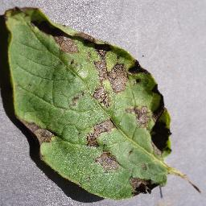
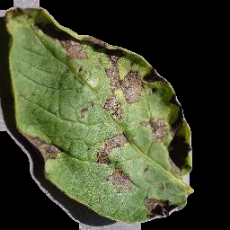
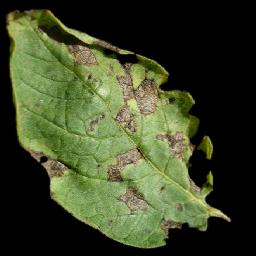

# Leaf Segmentation

A leaf segmentation algorithm written in Python3 using OpenCV

## Requirements

+ Python3
+ Numpy
+ OpenCV
+ Scipy

## Installing Requirements

+ For Debian/Ubuntu

```
sudo apt install python3-opencv python3-scipy python3-numpy
```

+ For Fedora

```
sudo dnf install python3-opencv python3-scipy python3-numpy
```

+ For Google Colab
```
pip install opencv-python numpy scipy
```

## License

+ GPLv3. See the COPYING file for details.

---

## Sample Output from Google Colab

```
===================================
RGB image
```

```
Resulted image
```

```
Segmented image
```

```
Success rate: % 91.900634765625
Elapsed time: 0.2488720417022705 s
===================================
Average success rate: % 91.900634765625
Average elapsed time: 0.2488720417022705 s
```
